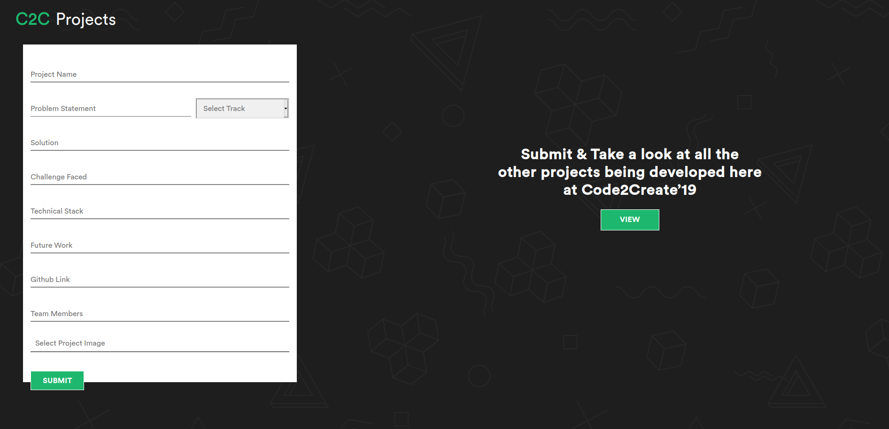
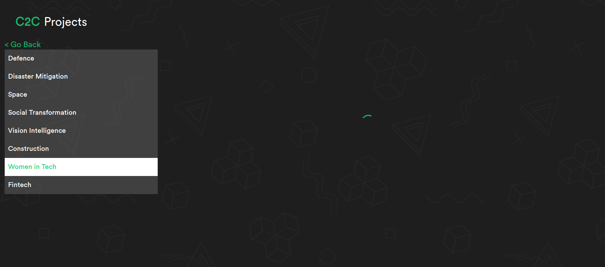

# Code2Create'19 Project Portal - Frontend
A portal for uploading and reviewing projects made during Code2Create'19

## Application Screenshots

## Steps to run application
- Step 1: Fork the repository and clone it to your machine
- Step 2: Change directory to the local clone using `cd c2c-project-portal`
- Step 3: Install all the application dependencies using `npm install`
- Step 4: Run the application using `npm start`
- Step 5: Open `localhost:3000` in your favourite browser :)

## Contributors
- [Aditya Srivastava](https://github.com/adityasrivast)
